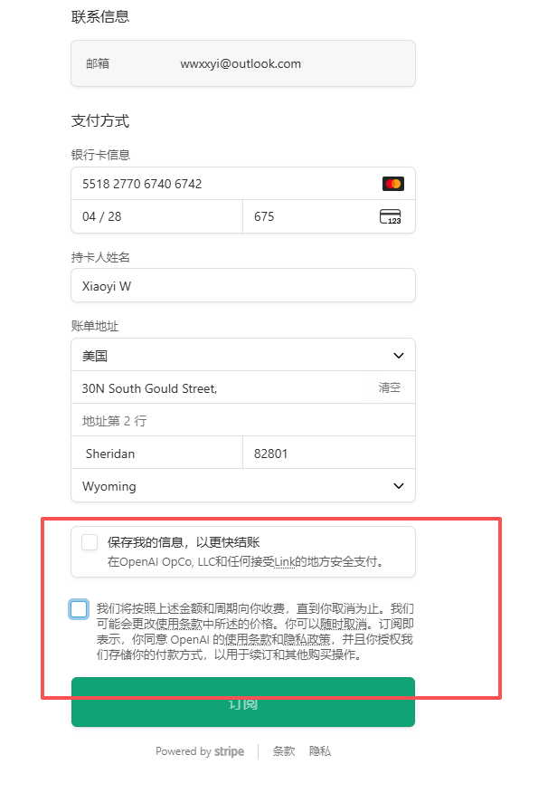

ChatGPT士兵认证优惠，在outlook里面重新注册一个邮箱注册ChatGPT账号，然后点击https://chatgpt.com/veterans-claim，认证士兵优惠，需要米国ip，然后在认证界面，目前有三种方法，个人觉得最省事的就是花10元左右买个卡密，去网站直接认证通过。第一种，需要下载油猴插件，脚本爬取米国逝世士兵的信息。第二种使用机器人验证，discord认证https://discord.com/invite/7mt422QN9Y，tg 认证https://t.me/Veriyferbot?start=ref_7427721393第三种花钱买卡密，网址https://verify.kxblog.top/verify.php，购买卡密后直接把认证界面的地址地址和买的卡密复制上去，立马就认证成功。接下来是绑卡环节，绑卡依旧是visa卡或者可以生成虚拟的卡，经过两次审查，即可免费获得一张虚拟卡信息。先用https://namso-gen.com/?tab=advance&network=MasterCard用advance，bin使用551827706xxxxxxx，生成一百张虚拟卡信息，然后将信息全部复制到https://chkr.cc/这个网站，然后审核通过live的几个虚拟卡信息，将筛选过后的虚拟卡信息再复制到https://mock.payate.com/这个网站，这个网站审核完毕后，就能得到一张真正能使用支付的虚拟卡，之后就可以将信息粘贴到ChatGPT支付订阅的界面，这样操作下来就可以订阅一年的ChatGPT plus

# 地址

名字随便
地址美国
卡片填写地址信息:30N South Gould Street, Sheridan, WY 82801
邮编82801

美国或者新加坡环境支付

